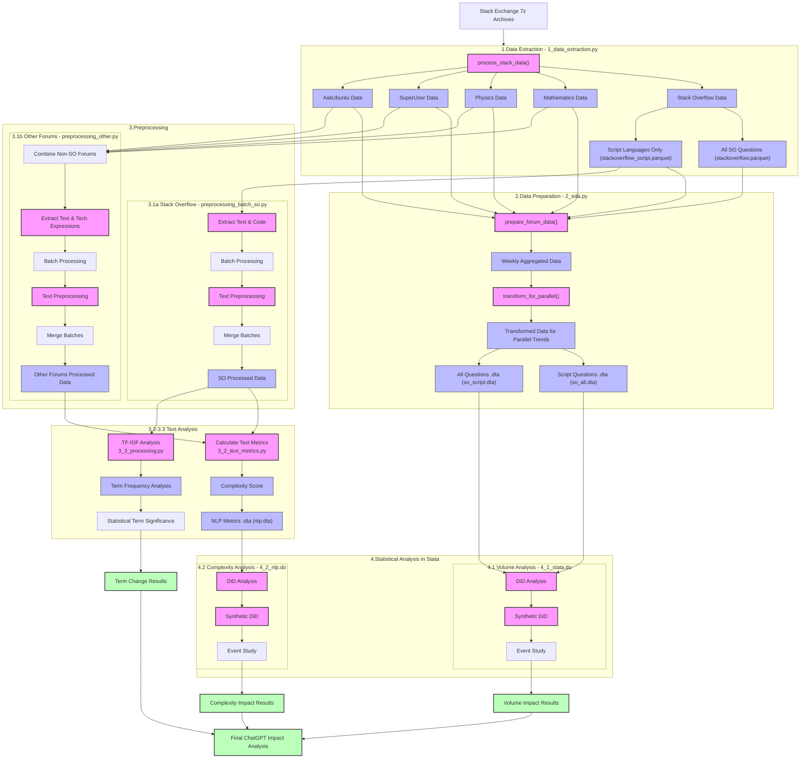

# Text Mining 2024-2025 - Final Project

## Authors

- Blanca Jimenez
- Maria Simakova
- Moritz Peist

## ChatGPT's Impact on Stack Overflow Question Patterns: An NLP Analysis

This project investigates how Large Language Models (specifically ChatGPT, released in November 2022) have influenced question patterns on Stack Overflow, implementing an integrated framework combining synthetic difference-in-differences (DiD) methodology with text mining techniques to establish causal relationships between ChatGPT's introduction and changes in programming knowledge-seeking behavior.

## Project Overview

Stack Overflow has been the premier Q&A platform for programmers for over a decade, but ChatGPT represents a technological disruption in how programmers seek information. Our project applies robust causal inference methods combined with computational text analysis to examine changes in question volume, complexity, and content following ChatGPT's release.

### Research Questions & Hypotheses

1. **H1**: Simple, common programming questions have decreased in frequency post-ChatGPT, particularly for scripting languages (JavaScript, Python, R, PHP)
2. **H2**: Question complexity and specificity have increased as users turn to Stack Overflow for more challenging problems
3. **H3**: The distribution of question topics has shifted toward more specialized and advanced concepts
4. **H4**: The linguistic features of questions have changed in measurable ways through TF-IDF analysis

## Methodology

Our approach integrates causal inference with text mining through a two-phase analytical framework:

### 1. Data Extraction & Preparation

- Extract data from Stack Exchange archives (January 2021 - March 2024)
- Process questions from Stack Overflow and control forums (Mathematics, Physics, SuperUser, AskUbuntu)
- Focus specifically on scripting language questions (JavaScript, Python, R, PHP)
- Aggregate data to weekly level for time-series analysis

### 2. Text Preprocessing & Feature Extraction

- Batch process large datasets of HTML content from questions
- Extract separate components: text, code blocks, and technical expressions
- Implement NLP pipeline with tokenization, stopword removal, and lemmatization
- Calculate standardized complexity metrics:
  - Tag count (normalized)
  - Code/technical expression length (normalized)
  - Question body length (normalized)
  - Title length (normalized)
  - Composite complexity score across all features

### 3. Causal Framework: Synthetic DiD Analysis

- Implement synthetic control methodology to create counterfactual Stack Overflow trajectories
- Control for temporal trends using non-programming Stack Exchange sites
- Test parallel trends assumptions through transformations (log, indexed)
- Apply rigorous event study approach to measure temporal effects
- Calculate treatment effects for both:
  - Question volume impact (quantity effect)
  - Question complexity impact (quality effect)

### 4. Text Mining & Significance Testing

- Implement TF-IDF analysis to identify changing term importance
- Statistical testing of term frequency shifts (Mann-Whitney, permutation tests)
- Bootstrap confidence intervals for term importance changes
- Visualize significant changes in programming vocabulary post-ChatGPT

## Data Sources

- Stack Overflow question data (January 2021 - March 2024)
- Control data from four non-programming Stack Exchange sites
- Focus on scripting languages (JavaScript, Python, R, PHP)
- Archive.org Stack Exchange data dumps (.7z XML files)

## Technical Implementation

- **Data Processing**: Custom XML extraction pipeline using Polars and lxml
- **Text Analysis**: NLTK and spaCy for preprocessing, scikit-learn for TF-IDF
- **Statistical Analysis**: Synthetic DiD implemented in Stata
- **Visualization**: Seaborn and Matplotlib for Python, integrated with Stata outputs
- **Batch Processing**: Memory-optimized pipeline for processing multi-million question datasets

## Key Findings

- Quantifiable volume effects: Significant decrease in question frequency post-ChatGPT
- Complexity shifts: Increase in question complexity metrics following ChatGPT's introduction
- Term importance: Statistically significant changes in programming terminology usage
- Evidence of topic shifts toward more specialized concepts
- Heterogeneous effects across programming languages

## Repository Structure

```
├── code/
│   ├── 1_data_extraction.py         # Extract data from Stack Exchange archives
│   ├── 2_eda.py                     # Data preparation and exploratory analysis
│   ├── 3_1_preprocessing_batch_so.py # Batch processing for Stack Overflow
│   ├── 3_1_preprocessing_other.py   # Batch processing for control forums
│   ├── 3_2_text_metrics.py          # Calculate complexity metrics
│   ├── 3_3_processing.py            # TF-IDF and term significance analysis
│   ├── 4_1_stata.do                 # Volume analysis with synthetic DiD
│   └── 4_2_nlp.do                   # Complexity analysis with synthetic DiD
├── data/                            # Data directory (not in repo due to size)
└── imgs/                            # Output visualizations
```

##

In the following a sketch of our entire processing pipeline (subject to change):



## Team

This project is being developed as part of the Introduction to Text Mining and Natural Language Processing course.

## License

[MIT License](LICENSE)
