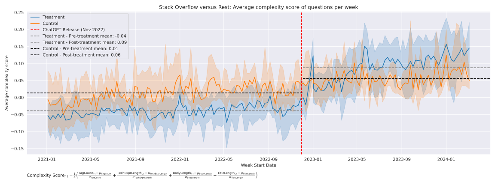

# Overflow Under-Flowed: ChatGPT's Impact on Stack Overflow

This project investigates how ChatGPT's release has transformed question patterns on Stack Overflow, combining causal inference with text mining to measure both quantitative and qualitative impacts.

## Authors

- Blanca Jimenez
- Maria Simakova
- Moritz Peist

## Project Overview

The advent of Large Language Models (LLMs) has triggered a paradigm shift in how individuals seek and obtain technical information. Stack Overflow, as the premier programming question-and-answer platform, has long been the go-to resource for developers facing coding challenges. However, with the public release of ChatGPT in November 2022, developers gained access to an AI assistant capable of providing immediate, contextual programming guidance—potentially disrupting established knowledge-seeking patterns on specialized forums.


Our dataset spans January 2021 to March 2024, with a focus on scripting languages (JavaScript, Python, R, and PHP) that represent the largest volume of Stack Overflow questions and are areas where early versions of ChatGPT demonstrated particular strength. For the causal analysis component, we incorporate data from four non-programming Stack Exchange forums as control units.

## Key Findings

- **Significant Volume Reduction**: ChatGPT caused a 39.5% reduction in scripting language questions (JavaScript, Python, R, and PHP)
- **Complexity Increase**: Questions have become significantly more complex after ChatGPT's introduction
- **Content Shifts**: Term importance analysis shows troubleshooting and technical terms increased, while basic programming concepts decreased

## Abstract

Applying the Technology Acceptance Model framework, we analyze how ChatGPT's perceived usefulness and ease of use have reshaped developers' information-seeking behavior. Using a Synthetic Difference-in-Differences approach with data spanning January 2021 to March 2024, we establish that ChatGPT caused a significant 39.5% reduction in scripting language questions (JavaScript, Python, R, and PHP). Beyond this volumetric decline, we demonstrate a statistically significant increase in question complexity following ChatGPT's introduction.

Our TF-IDF analysis reveals meaningful linguistic shifts: terms related to troubleshooting and technical infrastructure increased in importance, while basic programming concepts declined significantly. These findings align with recent research suggesting developers strategically allocate questions between platforms based on perceived usefulness for specific query types. Our research provides empirical evidence of how large language models reshape knowledge-sharing dynamics in technical communities, pointing to a complementary relationship between AI tools and human-moderated forums.


## Research Questions & Approach

1. To what extent has ChatGPT's introduction causally affected question volume on Stack Overflow?
2. How has the nature and complexity of questions changed post-ChatGPT?

We approach these questions through a two-stage methodology:

1. **Establish causality** through a Synthetic Difference-in-Differences (SDID) framework, quantifying the volumetric impact while controlling for temporal trends
2. **Apply NLP analysis** to understand changes in term frequencies and track question complexity changes before and after ChatGPT's release

## Methodology

### Causal Impact Analysis

- Synthetic DiD approach to construct counterfactual for Stack Overflow
- Control groups: Mathematics, Physics, Superuser, and AskUbuntu forums
- Event study analysis to track effects over time

### Text Mining & Complexity Analysis

- Composite complexity score based on title length, body length, tag count, and code/technical expression length
- TF-IDF analysis with statistical significance testing
- Bootstrap confidence intervals for term importance changes



## Complexity Score Analysis

We constructed a parsimonious complexity score for forum posts composed of 4 key elements:

1. Title length
2. Body length
3. Number of tags
4. Length of technical expressions (code blocks for programming forums, equations for Mathematics/Physics)

The standardized complexity score is calculated as:

```
Complexity Score = 1/4 * (Z(TagCount) + Z(TechExprLength) + Z(BodyLength) + Z(TitleLength))
```

Where Z represents the z-standardization of each metric across all questions in our dataset.

Our synthetic DiD analysis reveals a statistically significant increase in question complexity (0.059 standard deviations) following ChatGPT's release. This effect grew stronger over time, with the most recent period showing the largest impact (0.092 standard deviations), suggesting a fundamental shift in how developers utilize Stack Overflow rather than a temporary adjustment.

## Repository Structure and Processing Pipeline

Below is a visualization of our entire processing pipeline, showing how data flows through the different stages of analysis:


## Repository Structure

```
├── code/
│   ├── 1_data_extraction.py         # Extract data from Stack Exchange archives
│   ├── 2_eda.py                     # Data preparation and exploratory analysis
│   ├── 3_1_preprocessing_batch_so.py # Batch processing for Stack Overflow
│   ├── 3_1_preprocessing_other.py   # Batch processing for control forums
│   ├── 3_2_text_metrics.py          # Calculate complexity metrics
│   ├── 3_3_processing.py            # TF-IDF and term significance analysis
│   ├── 4_1_stata.do                 # Volume analysis with synthetic DiD
│   └── 4_2_nlp.do                   # Complexity analysis with synthetic DiD
├── data/                            # Data directory (not in repo due to size)
└── imgs/                            # Output visualizations
```

## Data Sources

- [Stack Overflow data (January 2021 - March 2024)](https://archive.org/download/stackexchange)
- [Control data from four non-programming Stack Exchange sites](https://archive.org/download/stackexchange)
- Focus on scripting languages (JavaScript, Python, R, PHP)

## Interpretation & Conclusions

Our findings support the hypothesis that ChatGPT has altered information-seeking behavior in programming communities. Developers now appear to reserve simpler questions for ChatGPT while turning to Stack Overflow for more complex programming challenges that require human expertise.

The empirical evidence points to a complementary relationship between AI-powered assistants and human-moderated Q&A forums, with each platform serving distinct informational needs within the programming community. Stack Overflow appears to be evolving toward a repository for more complex programming questions, while more straightforward queries may be increasingly handled through interaction with large language models like ChatGPT.

## License

[MIT License](LICENSE)

---

*This project was developed as part of the Introduction to Text Mining and Natural Language Processing course at Barcelona School of Economics.*
